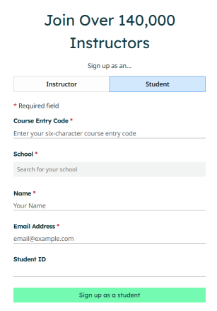
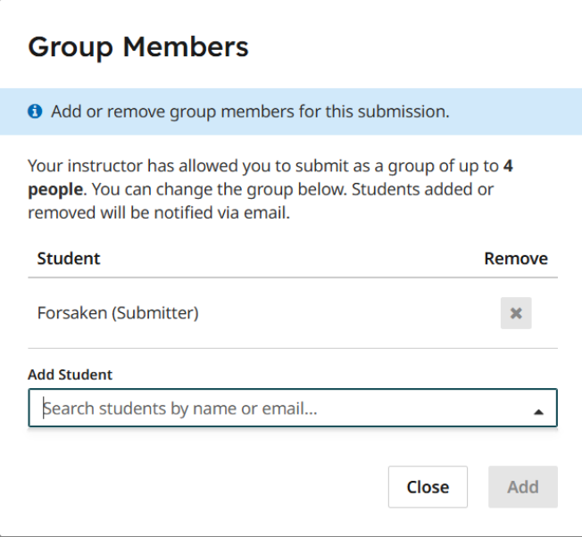
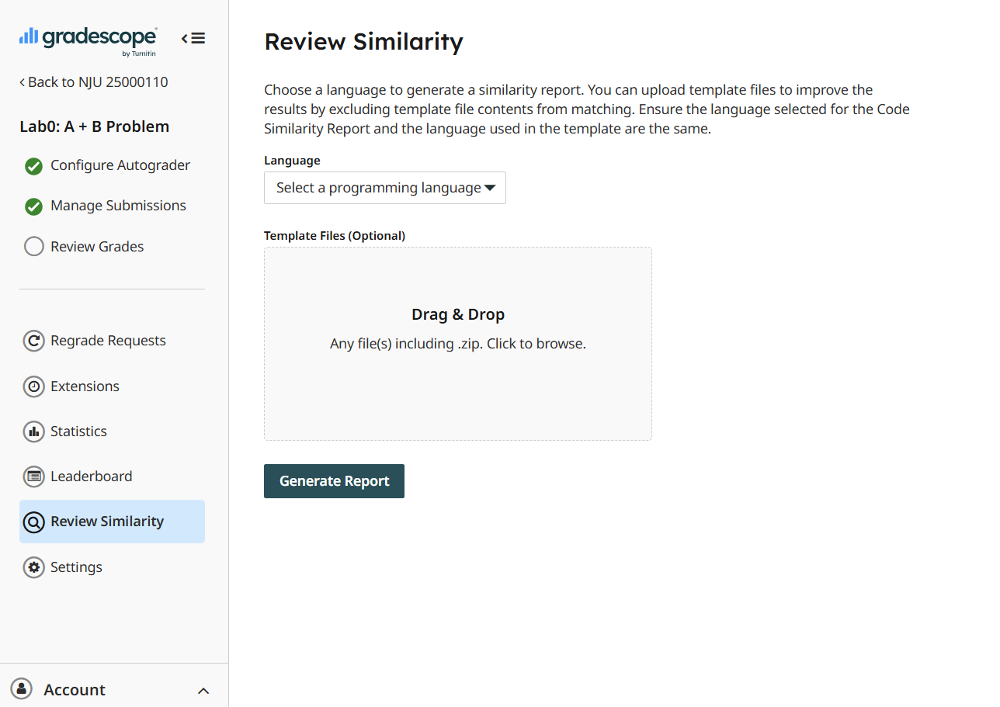

# OJ使用方法

## 注册 GradeScope

!!! tip "为什么使用GradeScope"
    （DeepSeek-V3）GradeScope 是一个在线评分和评估平台，主要用于教育领域，帮助教师高效批改作业、考试和项目。
    
    **优点：**

    - 自动化测试项目代码正确性，可以自定义检查规则（例如CodeStyle检查）
    - 提供代码相似性检查
    - 提供排行榜，方便大家查看自己的进度（可选）
    - 支持团队提交
    - 有机会支持同学任意选择C/C++/Java/Python语言完成课程实验

1. 访问 [GradeScope](https://www.gradescope.com/)，点击右上角的 `Sign Up`。选择Sign up as an..., 然后选择 `Student`，并点击 `Continue`。

    

2. Course Entry Code填写 **`EE8GVJ`**，School 选择 `Tsinghua University`。Name 请填写真实中文姓名，Student ID请填写清华校内学号。

3. 完成注册后登录，你可以看到你已经完成选课 Assembly and Compilation Principles (Fall 2025) 汇编与编译原理，请开始你的实验吧。

## 在GradeScope中组建队伍（大作业相关）

大作业**每次提交**都需要在GradeScope中组建队伍，请按照以下步骤操作：

1. 提交完代码后，点击页面最下方的`Group Members`按钮。

2. 根据系统提示添加小组成员。 

    

3. 注意你的小组成员必须和你在组队填报中填写的信息保持一致。

## 代码相似性检查

GradeScope 为老师和助教提供了代码相似性检查的功能，请不要拷贝其他同学或小组的代码实现。

代码抄袭是严重的学术不端行为，一经发现，后果自负。

